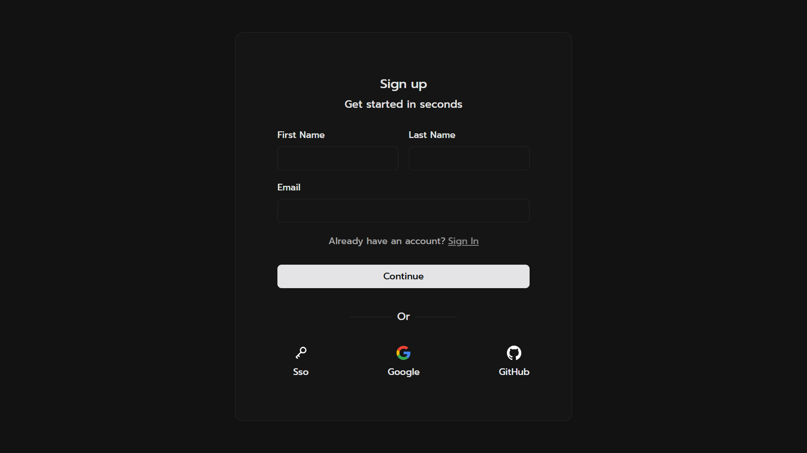
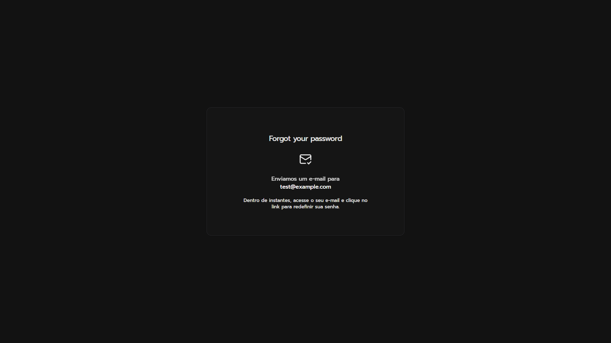
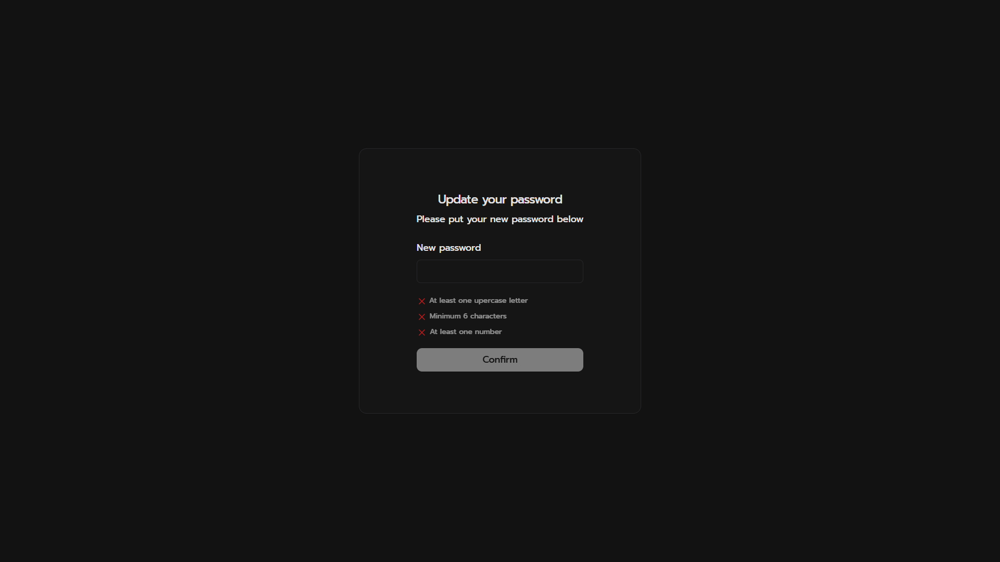

# Login App (React + Supabase)

Aplicação de autenticação construída como primeiro projeto completo do repositório. Usa Supabase para autenticação, React Router para navegação e um conjunto de componentes estilizados com Tailwind + Chakra UI/next-themes.

## Principais funcionalidades
- Fluxo de login em 2 passos: primeiro valida o e-mail, depois mostra o campo de senha com toggle de visibilidade e alerta de credenciais inválidas.
- Cadastro em 2 passos: coleta nome/sobrenome + e-mail e só depois solicita a senha; exibe erro quando o e-mail já existe.
- Recuperação de senha via Supabase: envia e-mail com link que redireciona para `/changepass`.
- Atualização de senha: valida requisitos mínimos (maiúscula, número e 6+ caracteres) antes de enviar para o Supabase e limpa o estado de recuperação.
- Rotas protegidas: `/test` só carrega com sessão ativa; `/changepass` só abre em contexto de recuperação ou sessão válida.
- Tema e design system: Chakra + next-themes para modo de cor; componentes reutilizáveis de card, button, input e ícones.

## Stack
- React 19 + TypeScript + Vite
- React Router 7 (navegação e proteção de rotas)
- React Hook Form + Zod (forms e validação)
- Tailwind + componentes Chakra/shadcn (UI)
- Supabase JS v2 (auth e sessão)

## Estrutura das pastas (resumo)
- `src/App.tsx`: controla sessão Supabase, estados de loading e password recovery, define rotas.
- `src/pages/`: telas de `Login`, `Signup`, `Forgot`, `ChangePass`, `Test`, `Loading`.
- `src/services/`: `supabaseClient.ts` cria o client com variáveis de ambiente; `authContext.ts` centraliza chamadas de auth.
- `src/components/ui/`: provider de tema (`provider.tsx`, `color-mode.tsx`) e componentes base (card, button, input, separator).
- `src/index.css`: fontes customizadas, variáveis de tema e reset geral.

## Pré-requisitos
- Node 20+ (recomendado) e npm.
- Projeto no Supabase com Authentication habilitada.
- URL e chave pública do Supabase (anon key).
- Defina no Supabase a URL de redirect para recuperação de senha: `http://localhost:5173/changepass` (ou a URL do deploy).

## Configuração e execução
1) Instale dependências  
`npm install`

2) Crie o arquivo `.env.local` na raiz com as chaves do Supabase:
```
VITE_SUPABASE_URL=https://SEU_PROJETO.supabase.co
VITE_SUPABASE_KEY=SEU_ANON_KEY
```

3) Rode em modo desenvolvimento  
`npm run dev`  
Use `npm run dev:host` se precisar expor na rede local.

4) Build de produção  
`npm run build`

5) Preview do build  
`npm run preview`

6) Lint (opcional)  
`npm run lint`

## Fluxo de autenticação
- `App.tsx` busca a sessão atual (`supabase.auth.getSession`) e escuta `onAuthStateChange`. Quando o evento é `PASSWORD_RECOVERY`, ativa o flag `isPasswordRecovery` e redireciona para `/changepass`.
- Rotas:
  - `/` → login; se já houver sessão, vai para `/test` (ou `/changepass` se em recovery).
  - `/signup` → cadastro em duas etapas.
  - `/forgot` → envia e-mail de reset via `resetPasswordForEmail`.
  - `/changepass` → só abre em contexto de recovery/sessão; envia `updateUser` com a nova senha e limpa o flag.
  - `/test` → página protegida simples com sign out (`supabase.auth.signOut`).

## Telas
- `Login`: valida e-mail, depois senha; botões sociais estão como placeholders.
- `Signup`: coleta nome/sobrenome/e-mail, depois senha; mostra erro se o e-mail já existe.
- `Forgot`: envia e-mail de recuperação e mostra instruções após o envio.
- `ChangePass`: checagens de força simples e atualização da senha.
- `Test`: rota protegida mínima para testar sessão/sign out.
- `Loading`: tela de carregamento usada no suspense e enquanto a sessão é buscada.

## Screenshots

| Login | Cadastro |
| --- | --- |
|  |  |

| Recuperar senha | Atualizar senha |
| --- | --- |
|  |  |

## Scripts npm
- `npm run dev` — servidor de desenvolvimento.
- `npm run dev:host` — dev server acessível na rede local.
- `npm run build` — build de produção.
- `npm run build:analyze` — build com modo de análise.
- `npm run preview` — serve o build gerado.
- `npm run lint` — checa lint.

## Próximos passos sugeridos
- Conectar botões de SSO (Google/GitHub) ao Supabase Auth.
- Adicionar feedback visual de erros vindos da API (toast/snackbar).
- Criar testes básicos (ex.: fluxo de login e rota protegida).
- Adicionar prints reais nas seções de placeholders acima.
